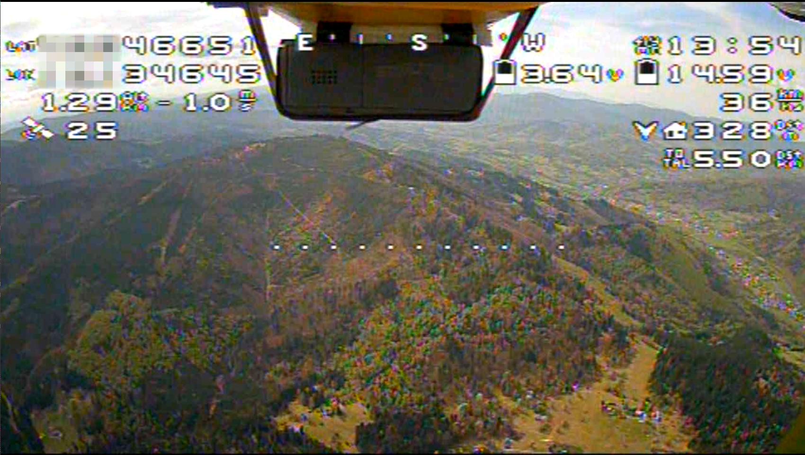
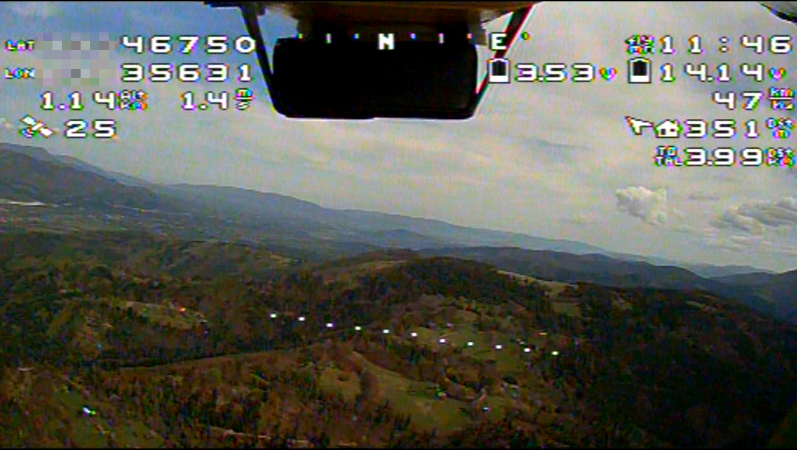
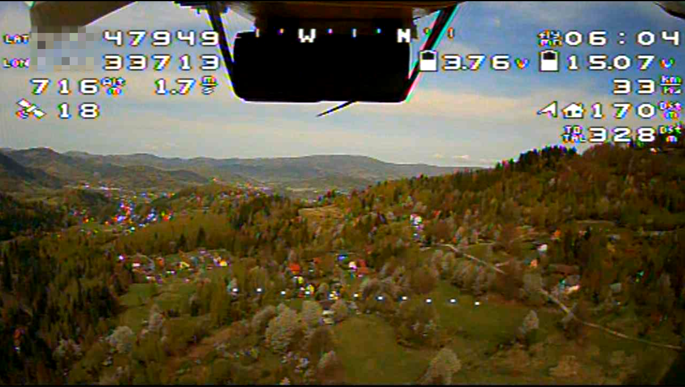
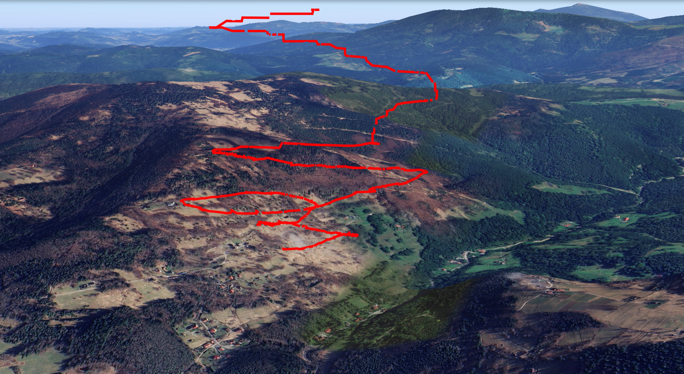
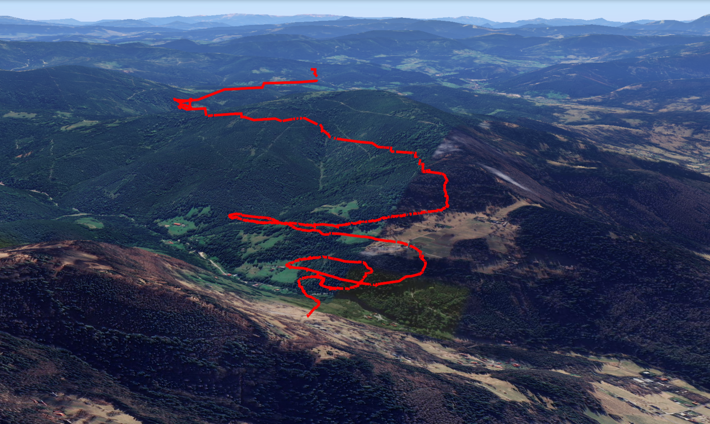
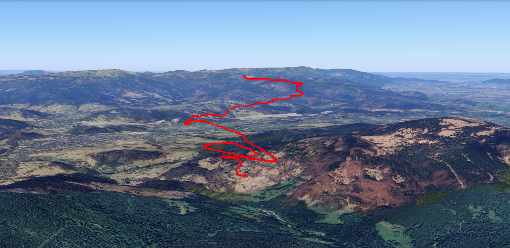

# aircraft-flight-path

Scripts for extracting aircraft positions from video via OCR and visualizing flight trajectories.  
The video was captured by a camera on the plane and recorded on VR goggles during the flight.

## Features
1. **OCR Extraction** – Detects and reads aircraft position numbers from video frames.
2. **Data Transformation** – Converts OCR results into structured datasets (latitude, longitude, altitude).
3. **Visualization** – Plots aircraft trajectories and positions for quick insights.

  
  
  

